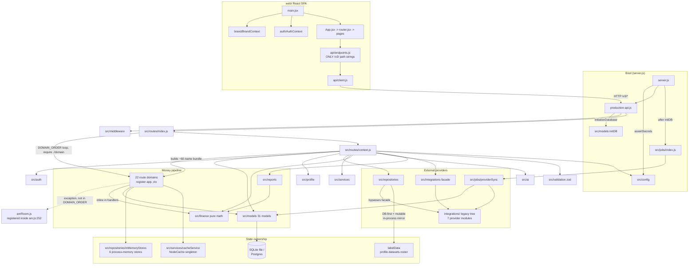

# ARCHITECTURE
Owner: Architect (ARC) · Last updated: 2026-09-29 (Phase 2 — design phase, REFACTOR_MODE=propose)

> Method: MAP.md (Phase 1, verified by reading) + own reading of the entry points,
> route mounting, middleware, models, jobs, profile, repositories and frontend entry.
> Nothing here is a fix; source stays read-only in Phases 2–4.

## 1. As-is architecture

**One-sentence shape.** A single-process Node/Express app (refactored 2026-09-28 from a
~3.2k-line monolith into `server.js` + `production-api.js` + `src/`) with a React/Vite SPA,
Sequelize over SQLite (default) or Postgres, node-cron jobs in the same process, and a
fictional "Pulsegrid" demo label resolved through a data-only Label Intelligence Profile.
The refactor was deliberately a **mechanical split, not a redesign**: handler bodies moved
verbatim, preserved defects and all (the module headers say so explicitly).

### 1.1 Layers (as they actually exist)

| Layer | Files | Responsibility |
|---|---|---|
| Entry | `server.js` | Canonical entrypoint. Owns exactly 3 things: `config.assertSecrets()` (JWT_SECRET required ≥16 chars, fail-closed), `api.initializeDatabase()` (refuses to listen on failure), job registration, `app.listen`, graceful SIGTERM/SIGINT + unhandledRejection/uncaughtException shutdown. Thin and correct. |
| Assembler | `production-api.js` | Pure Express assembler: `applyRequestPipeline` → `registerRoutes` (22 domains via DOMAIN_ORDER loop) → `applyErrorHandlers`. Exports `app` (binds no port), `initializeDatabase`, `PORT`. |
| HTTP middleware | `src/middleware/index.js` | Load-bearing order: helmet → compression → cors (ALLOWED_ORIGINS, locked in prod) → request-id → `express.json` (raw-body stash for the Stripe webhook) → request logger (token redaction) + completion log → rate limit on `/v3/`. Terminal: generic 500 `{error:'Internal server error'}` (MED-9 fixed — no err.message leak) + 404. |
| Route domains | `src/routes/*.js` (22) + `src/routes/anrRoom.js` | HTTP boundary: auth middleware, param/body parsing, response shaping. Registration order is load-bearing (DOMAIN_ORDER; five shadowed duplicate registrations make order part of the contract). Route modules receive a shared dependency bundle `ctx` (`src/routes/context.js`, ~60 injected names — transitional seam). |
| Auth | `src/auth/index.js` | Layer 1: pure JWT verify. Layer 2 (in `context.js`): composite `authenticateToken` revalidates the subject against the DB on **every** protected request (row exists, `active`, `sessionVersion`) — permission changes take effect immediately. |
| Business logic | **Spread across route handlers, `src/finance/*`, `src/services/*`** | `src/finance/` (decimal, reconciliation, commission, income, kpi, reviewState) is the one clean domain-logic island — pure money math. Elsewhere, business rules live inline in route handlers (CSV import pipeline, review-state transitions, sales sync, monthly-close aggregation). |
| Data access | `src/models/index.js` (31 Sequelize models, 761 lines) + `src/models/migrations.js` | `initDB({logger,labelData,demoMode})` runs explicit idempotent repair migrations, then `sequelize.sync()` (create-missing-tables). DEMO_MODE seeds the fictional Pulsegrid dataset; customer boots get an empty DB. |
| Repositories | `src/repositories/artistRepository.js`, `operationsRepository.js`, `inMemoryStores.js` | `artistRepository` is the one real repository: DB-first with an in-process `labelData` mirror (mutable shared object graph — see ARC-004). `inMemoryStores` is the single owner of six process-memory stores (prospects, anrSubmissions, anrState, userIntegrations, salesData, apiCache). |
| Cross-cutting services | `src/services/` (cacheService, emailService, entityAuditService, provenance, salesService, catalogIntegrityService, auditService, usageService) | Singleton instances; `cacheService` centralizes the NodeCache instance with byte-identical key strings and exposes `createCacheService()` for test injection. |
| Integrations | `src/integrations/` facade → legacy `integrations/` tree (spotify, youtube, twitter, instagram, tiktok, ticketmaster) | Facade pattern over a live legacy tree; `rateLimiter` + `wikipedia.fixtures` (fixture-only, gated by FIXTURE_WIKIPEDIA=1). `artistRepository` also requires `../../integrations` directly, bypassing the facade. |
| AI / analytics / reports | `src/ai/` (Groq, opt-in), `src/analytics/regression.js` (pure), `src/reports/monthlyReport.js` (pdfkit) | AI behind `src/routes/ai.js`; analytics projections served from synthetic data by design (the live-data loop `sync/masterLoop.js` is deliberately unwired — MAP-002). |
| Jobs | `src/jobs/index.js` registry | Explicit registration only (`registerJobs({enabled})` from server.js — no schedule-on-require). monthlyReportJob (`0 3 1 * *`), providerSync (`0 4 * * *`, opt-in via PROVIDER_SYNC_ENABLED). |
| Label profile | `src/profile/` — `index.js` resolves `labels/<slug>.js` from LABEL_PROFILE/LABEL_SLUG/ACTIVE_LABEL env, sanitizes the slug, falls back to `pulsegrid` | Data-only white-label seam (identity, seedUsers, datasets: roster/anr). Load-order rule documented and holding: profiles never require config/logger/models/services/routes (config→profile edge stays acyclic). |
| Validation | `src/validation/index.js` (zod) | `validateBody(schemaName)` middleware + `schemas` (login, forgotPassword, createUser, aiQuery). Adopted in **2 of 22** route domains (ai.js, users.js); the rest use hand-rolled inline validators (e.g. catalog.js string-returning validators) or none. |
| Frontend | `web/src/main.jsx` → BrandProvider/AuthProvider → App.jsx → router.jsx → pages → `api/client.js` + `api/endpoints.js` | `endpoints.js` is the only file with `/v3/` path strings (good centralization). `client.js` apiFetch/readJson/ApiError; 401 → onUnauthorized handler. Brand profiles static in `src/brand/profiles/`. |

### 1.2 Module dependency map (Mermaid)

Derived from `require()` grep plus the route `ctx` bundle.



### 1.3 Data flow (the money path, the crown jewel)

`POST /v3/royalties/import` (multipart CSV) → multer memory storage → handler in
`royalties.js` parses CSV, resolves ISRC/UPC via `catalog.js` regexes, computes exact
decimals via `src/finance/decimal.js` → `RoyaltyLine` rows + `RoyaltyStatement`
(statement identity: SHA-256 file hash, supersede chain) → `GET /v3/royalties/summary`
aggregates per-currency (exact decimals, rounding once at the boundary) →
`src/routes/monthlyclose.js` merges royalties + direct sales + manual adjustments +
commissions + bank deposits (cash evidence, not income) → `src/reports/monthlyReport.js`
renders the PDF (pdfkit + chartjs-node-canvas) → written to `reports/<YYYY-MM>/`, optionally
auto-printed via `lp`/`lpr` (execFile, AUTO_PRINT gate).

### 1.4 State ownership

| State | Owner | Durability | Notes |
|---|---|---|---|
| Product data (artists, catalog, royalties, payouts…) | `src/models/*` → SQLite/Postgres | Durable | 31 models; `labelData` mirror kept in sync in-process for reads |
| Roster reference data | `src/profile/labels/<slug>.js` datasets | In-process, immutable-by-contract, **mutable-in-fact** (ARC-004) | Fictional Pulsegrid roster; seed + demo read source |
| A&R workspace (demos, whiteboard, votes) | `inMemoryStores` + DB (submissions) | Split: submissions durable (4CF), demos/whiteboard ephemeral | Two divergent vote models — split-brain by design (documented) |
| Integration connection state | `inMemoryStores.userIntegrations` | Process memory, keyed by user id | Lost on restart; PM2 scale-out would fork it |
| Derived caches | `cacheService` (NodeCache, stdTTL 3600) | Process memory, TTL'd | Key namespace centralized, byte-identical keys |
| Auth sessions | JWT (24h) + per-request DB revalidation | Stateless token, stateful check | No server session store; `sessionVersion` revokes |
| Job output | Files (`reports/*.pdf`, `logs/*`, `backups/*.sqlite`), `ProviderSyncExecution` rows | Durable | Cron runs in the request process |

### 1.5 Scale-out assumptions (single-instance by construction)

`ecosystem.config.js` runs PM2 `fork` with 1 instance; `inMemoryStores` header explicitly
warns state is lost on restart and not shared between cluster workers. The app is correct
**only** as a single instance. Nothing enforces that except the PM2 config, whose currency
vs the current code is unverified (BLD lane). See ARC-004.

## 2. Assessment against the B9.3 checklist

### 2.1 Checklist table

| Checklist item | Verdict | Finding |
|---|---|---|
| God files (>500–800 lines) | **Fail.** `src/routes/royalties.js` (1076), `modules/entityAudit.js` (939), `src/models/index.js` (761), `src/routes/directsales.js` (712), `src/routes/monthlyclose.js` (564). | ARC-001 |
| God functions (>60–80 lines) | **Fail.** `POST /v3/royalties/import` handler spans L307–692 (~380 lines: CSV parse + ISRC/UPC resolution + decimal math + dedup + statement identity + DB writes in one async closure). Same shape in directsales `/sync` (L242–360) and monthlyclose aggregations. | ARC-001 |
| Mixed concerns (routing + business + data access) | **Fail.** Money domains have no service layer: route handlers call Sequelize directly, run parsing/math, and own state-machine transitions. `src/finance/` (pure math) is the exception, used by 5 route domains but not owned by any service boundary. | ARC-002 |
| Layering violations | **Partial.** `royalties.js:82` requires `./catalog` for ISRC_RE/UPC_RE (domain constants owned by a route module); `artistRepository` requires the legacy `integrations/` tree directly, bypassing the `src/integrations` facade. | ARC-009 |
| Circular dependencies | **Pass.** `require()` graph is a DAG (MAP verified). The one dangerous edge (config → profile → ?) stays acyclic because profiles are data-only (rule documented and holding — verified, not merely asserted). | — |
| Shared mutable globals | **Fail.** `labelData` is the same object graph shared process-wide and mutated in place (archive/restore/image/POST artists; in-place sort pinned by tests). `inMemoryStores` is six process-memory stores with no durability story. `ctx` fans the raw JWT secret + `fs`/`path`/`bcrypt` into all 22 route domains. | ARC-003, ARC-004 |
| Hidden coupling | **Partial.** Registration order is load-bearing (DOMAIN_ORDER + shadowed duplicates — documented as contract, pinned by tests, but still a trap for the next editor). | noted |
| Duplication / parallel versions | **Fail (structural).** Two live integration trees (`integrations/` legacy + `src/integrations/` facade). Three ad-hoc pagination patterns, two validation styles, varying success envelopes. | ARC-005, ARC-008 |
| In-memory state vs scaling | **Fail.** See §1.5: correct only as a single instance; nothing but the PM2 config enforces it. | ARC-004 |
| One source of truth for data | **Partial.** `artistRepository` made the DB the canonical store (4CF) — good. But schema authority is split between `sequelize.sync()` (create) and hand-written `src/models/migrations.js` (alter): a future model-field change without a matching migration entry gives new customers the field and existing customers silent drift. Demo-vs-real separation is by convention (`demoMemoryAllowed()` at every read site), not construction. | ARC-006, ARC-007 |
| Mock/real separation | **Partial.** DEMO_MODE gates seeding and `demoMemoryAllowed()` gates reads; fixtures are deterministic with expected.json assertions — good bones. But demo roster and customer mirror share one mutable `labelData` graph, and demo/customer share the same default DB file path shape. One missed gate = fictional artists in a customer DB-backed list. | ARC-007 |
| API consistency | **Mostly pass.** `/v3/` versioning uniform; `{error}` failure shape consistent across 4xx/5xx (89×400, 87×500, 74×403, 45×404 measured); `web/src/api/endpoints.js` centralizes all paths. **Gaps:** success envelopes vary (`{success}`, `{id}`, `{url}`, raw objects); three pagination patterns (in-memory slice with default limit 50, hard clamp 500/100, `findAll({limit:200})`); zod validation in 2/22 domains. `docs/openapi.json` (4574 lines) exists; sync vs the 22 domains is DOC's claims audit. | ARC-008 |
| Config centralization | **Pass.** `src/config/index.js` is the single env surface (50 vars, `assertSecrets` fail-closed). Minor: `registerJobs` reads `process.env.PROVIDER_SYNC_ENABLED` directly instead of via config; `server.js` reads `SCHEDULE_JOBS` directly. | note |
| Error-handling strategy | **Pass (terminal), partial (domain).** Terminal middleware is clean: 400 for malformed JSON, generic 500, 404 — no internal leakage. But there is no domain error taxonomy: route handlers return `{error}` strings ad hoc, and several middlewares duplicate "auth required" guards (`requireAuth` in catalog.js vs composite `authenticateToken`). No error codes for the frontend to branch on. | ARC-008 |
| Logging/observability | **Pass-ish.** Winston centralized; request-id assigned before body parsing; completion log with userId/status/durationMs; token redaction in logs. Gaps: no error codes (see above), no metrics endpoint, job runs logged but not health-checked. | note |
| Testability seams | **Partial.** Good: `registerRoutes(app, ctx)` accepts an injected context; `createCacheService()` allows fake caches; jobs are explicit (`registerJobs({enabled})`) so tests don't start timers; `production-api` exports `app` without binding a port. Bad: money logic lives in HTTP handlers (untestable without supertest), `buildContext()` eagerly requires everything (module-load side effects), stores are module singletons. | ARC-002 |
| Evolvability | The riskiest part to change is the money pipeline (import → dedup → summary → monthly close → payout) because its rules are embedded in handlers, and route registration order, because it is behavior. Adding the next read-model route is cheap; adding the next money-affecting rule is not. | — |

### 2.2 Strengths worth preserving

1. **Honest headers.** Every module documents what it preserves, including defects — the
   refactor's "preserved defect" discipline makes the as-is legible. Keep this convention
   through any migration.
2. **Mechanical-split discipline.** Verbatim handler bodies + 361 green tests + DOMAIN_ORDER
   pinning meant the refactor changed structure without changing behavior. The migration
   plan (§4) copies this playbook: characterization tests first, then moves.
3. **Config and profile seams.** Centralized env with fail-closed secrets; data-only label
   profiles with a documented, verified acyclic load order. These are the two best
   architectural decisions in the tree — the target keeps both.
4. **`src/finance/` pure-math island** and the **explicit job registry** (no schedule-on-require)
   are the patterns to spread, not the exceptions to tolerate.
5. **`docs/openapi.json`** exists (4574 lines) — a contract artifact the frontend can be
   checked against once DOC's sync audit lands.

## 3. Target structure (REFACTOR_MODE=propose — design only, no moves)

Principles: keep the stack (Express 4, Sequelize, React), keep single-instance-per-label
deployment, keep `server.js` thin and `production-api.js` as assembler. No microservices
for a solo-label app. Every change below is behavior-preserving unless flagged.

```
server.js                          # unchanged shape: guard -> initDB -> jobs -> listen
production-api.js                  # assembler only (already is)
src/
  config/            index.js      # the env surface (already centralized)
                     logger.js     # winston (already centralized)
  http/              NEW
    pipeline.js      # applyRequestPipeline (moved from middleware/index.js)
    errors.js        # NEW: domain error classes (NotFound, ValidationError,
                     #   Forbidden, Conflict, ProviderError) -> {error, code, requestId}
    envelope.js      # NEW: ok(data, meta), paginated(rows, {limit, offset, total})
    pagination.js    # NEW: parsePagination(req) - single clamp policy
  db/                # (rename of models/ - NEEDS OWNER)
    index.js         # sequelize instance + model registry (split: models/*.js per model)
    migrations.js    # explicit migrations ONLY - sync() becomes a boot-time
                     # assertion that schema matches (ARC-006), or stays as
                     # "create-if-absent" with the contract documented + drift test
  domains/           # one folder per route domain (was: flat src/routes/*.js)
    royalties/
      routes.js      # thin: auth, validateBody, call service, envelope
      service.js     # import pipeline, summary computation (moved from handler)
      schemas.js     # zod request/response shapes
      constants.js   # ISRC_RE/UPC_RE live HERE (not in a route module)
    directsales/     # routes.js + service.js + schemas.js
    monthlyclose/    # routes.js + service.js + schemas.js
    catalog/         # routes.js + service.js + schemas.js
    artists/  auth/  users/  anr/  marketing/  reports/
    operations/  analytics/  system/  billing/  oauth/  sync/
      # each: routes.js (thin) + service.js where logic exists today +
      # schemas.js as validation coverage grows
    shared.js        # DOMAIN_ORDER + registerDomains(app, deps) (replaces routes/index.js)
  services/          # cross-domain singletons (cache, email, audit...) - unchanged
  repositories/      # artistRepository (unchanged) + durable stores as they migrate
  integrations/
    index.js         # facade (unchanged surface)
    providers/       # merged legacy tree (NEEDS OWNER - file moves)
    rateLimiter.js   # as-is
    fixtures/        # wikipedia.fixtures etc.
  finance/           # pure money math - UNCHANGED, now the pattern, not the exception
  ai/ analytics/ reports/ jobs/ profile/ utils/ validation/
                     # as-is, except jobs/ bodies keep pure run() + thin schedule wrapper
web/                 # unchanged shape; endpoints.js stays the single path surface.
                     # Contract check: generated client types from openapi.json (later)
```

**Layering contract (target).**
- `domains/<x>/routes.js`: HTTP only — auth, `validateBody`, call service, return envelope.
  No Sequelize, no CSV parsing, no money math.
- `domains/<x>/service.js`: business rules + orchestration; takes `{ models, repos, services }`
  as constructor args (no module-scope singletons) so tests inject fakes.
- `src/finance/`: pure functions only (no I/O) — unchanged.
- `repositories/`: all DB access for a domain goes through here where a domain is DB-heavy;
  thin domains may use models via their service, but never from routes.
- `http/errors.js`: every failure maps to `{ error, code, requestId }`; terminal middleware
  stays the only place that decides status codes for unknown errors.

**Config strategy:** keep `src/config/index.js` as the single env surface; move the two
stragglers (`PROVIDER_SYNC_ENABLED` in jobs/index.js, `SCHEDULE_JOBS` in server.js) behind it.
No new config files.

**Error-handling strategy:** domain error classes thrown from services, mapped once in
`http/errors.js` to status + `{error, code, requestId}`; terminal middleware keeps the
generic-500 no-leak guarantee; `requestId` already flows everywhere.

**Logging/observability:** keep winston + request-id + completion log; add `code` from the
error taxonomy to the completion log line; add a `/v3/system/health` deep check that
verifies DB reachability (job runs logged but not health-checked today).

**Testing seams:** services are constructed with deps (no `require('../models')` at module
scope inside services); `registerDomains(app, deps)` keeps the injectable-context seam;
time via an injectable clock in `domains/*` (deterministic tests); fixtures stay in
`demo/dataset-v1` with `expected.json` assertions.

## 4. Migration plan

Rules: each step is independently shippable, behavior-preserving, and reversible by
reverting its commit(s). Characterization tests (supertest against the running app +
snapshot of responses) must exist BEFORE the step's first code move. Steps that rename,
move, or delete files, or change public API/URLs/response shapes, carry
**NEEDS-OWNER** and stop for approval — per B1 they are never done silently.

| # | Step | Characterization tests first | Risk | Effort | Needs owner? |
|---|---|---|---|---|---|
| 1 | **Pin the money pipeline.** Add supertest characterization tests for royalty import (idempotent re-upload, supersede, dedup), `/v3/royalties/summary` totals, monthly-close aggregation, and financials export. Snapshot response bodies. | n/a (this IS the tests) | Low | M | No (tests only — pre-approved) |
| 2 | **Adopt zod validation domain by domain.** Add `schemas.js` per domain (royalties, directsales, monthlyclose first), wire `validateBody`; keep 400 `{error, details}` shape. | Step 1 + per-domain invalid-input tests | Low | S per domain | No |
| 3 | **Extract domain constants.** Move ISRC_RE/UPC_RE (and siblings) from `src/routes/catalog.js` to a shared `src/finance/catalogKeys.js` (or `src/domains/shared`); `royalties.js` and `catalog.js` both import from there. | Existing catalog/royalty tests | Low | XS | **Yes** (new file + cross-module import changes; small, but Lead should bless the home) |
| 4 | **Narrow the ctx bundle.** Give each domain only the deps it destructures (mechanically derived), stop fanning `JWT_SECRET`/`fs`/`path`/`bcrypt` into every domain; keep `registerRoutes(app, ctx)` signature. | Full regression suite | Low | S | No (internal wiring; broad diff — Lead review recommended) |
| 5 | **Extract `royalties` service.** Move the import pipeline + summary computation out of the handlers into `src/services/royaltiesService.js` (deps injected); handlers become thin. | Step 1 | Medium | M | No (same files, internal) |
| 6 | **Extract `directsales` + `monthlyclose` services.** Same pattern as #5; reconciliation/export move with their service. | Step 1 | Medium | M | No |
| 7 | **Split god route files.** `royalties.js` → `import.js`/`summary.js`/`review.js`(+`lines.js`); same for directsales/monthlyclose; register all in DOMAIN_ORDER (order preserved). | Steps 1+5+6 | Medium | M | **Yes** (file renames/moves) |
| 8 | **Merge the integration trees.** Move `integrations/*` providers under `src/integrations/providers/`; facade surface unchanged; `artistRepository` goes through the facade. | Provider-sync tests + fixture-mode tests | Medium | M | **Yes** (file moves) |
| 9 | **Resolve `sequelize.sync` vs migrations.** Either (a) keep "sync creates, migrations alter" with a boot-time drift test that fails the build when a model field lacks a migration entry, or (b) go migration-only. | InitDB tests on empty + upgraded DBs | Medium | S | **Yes** (schema authority is a product decision — QUESTIONS.md) |
| 10 | **Decide each in-memory store's fate.** `userIntegrations` → DB table (or encrypted at rest with the OAuth token store); `salesData`/`apiCache` → documented-ephemeral or removed; A&R split-brain unified or formally declared (product call). | Store-behavior tests | Medium | M | **Yes** (persistence + product semantics — QUESTIONS.md) |
| 11 | **Unify pagination + success envelope.** `src/http/pagination.js` + `envelope.js`; migrate domains one at a time; frontend `readJson` already tolerates shapes — verify. | Pagination boundary tests | Low | S | **Yes** (response-shape change, even if additive — owner call) |
| 12 | **Jobs out of the request process (or formally pinned in).** Either move cron bodies to a separate worker entry (`jobs-worker.js`, same code, `run()` exported) or document-and-pin single-process with a boot assertion and PM2 `instances: 1` lock. | Job run tests (already exist) | Medium | M | **Yes** (deploy topology — QUESTIONS.md) |
| 13 | **Harden demo/customer separation.** Single chokepoint for the fictional roster + a boot-time test asserting a customer boot (DEMO_MODE unset) serves zero fictional rows on every list endpoint. | New test (this is it) | Low | S | No |
| 14 | **Contract check.** Generate a client-shape check from `docs/openapi.json` against `web/src/api/endpoints.js` in CI (`web/validation/gate.mjs` already exists — extend it). | Existing gate | Low | S | No |

**Order rationale:** tests first (#1) because every later step leans on them; validation
(#2) and constants (#3) are cheap confidence builders; ctx narrowing (#4) makes #5–#7
safer by shrinking the diff surface; services (#5–#6) before file splits (#7) so the
splits move thin handlers; schema/stores/topology (#9–#12) are owner decisions and go
late, after the code is already shaped to make them easy.

## 5. Open design questions (-> QUESTIONS.md)

The following are logged in `devteam/QUESTIONS.md` as Q-ARC-1…Q-ARC-6 with Status OPEN.
Recommendations are the Architect's; the owner decides.

- **Q-ARC-1 — Merge the legacy `integrations/` tree into `src/integrations/providers/`?**
  Recommend yes (step 8). The facade already exists; the legacy tree is live, not legacy-dead.
- **Q-ARC-2 — Schema authority: keep "sync creates + explicit migrations alter", or go migration-only?**
  Recommend the drift-test variant (step 9a): keeps cold-boot simplicity, closes the upgrade-drift hole.
- **Q-ARC-3 — What is the production topology: single PM2 instance forever, or is scale-out on the roadmap?**
  Recommend: formally pin single-instance (boot assertion + docs) OR commit to externalizing
  `inMemoryStores` + cache (step 12). The current state — correct-only-by-PM2-config — is the risk.
- **Q-ARC-4 — Should A&R's two vote models be unified, and should the A&R workspace become durable?**
  Product decision (step 10). The split-brain is documented and preserved; unifying changes vote semantics.
- **Q-ARC-5 — May success envelopes and pagination be unified (additive shape change)?**
  Recommend yes, one domain at a time (step 11).
- **Q-ARC-6 — Is `docs/openapi.json` the maintained API contract (and should the frontend be checked against it in CI)?**
  Recommend yes (step 14); if not, say so and stop hand-editing it.

---
*Phases 2–3 deliverable. REFACTOR_MODE=propose: no file was moved, renamed, or edited outside `devteam/`.*
