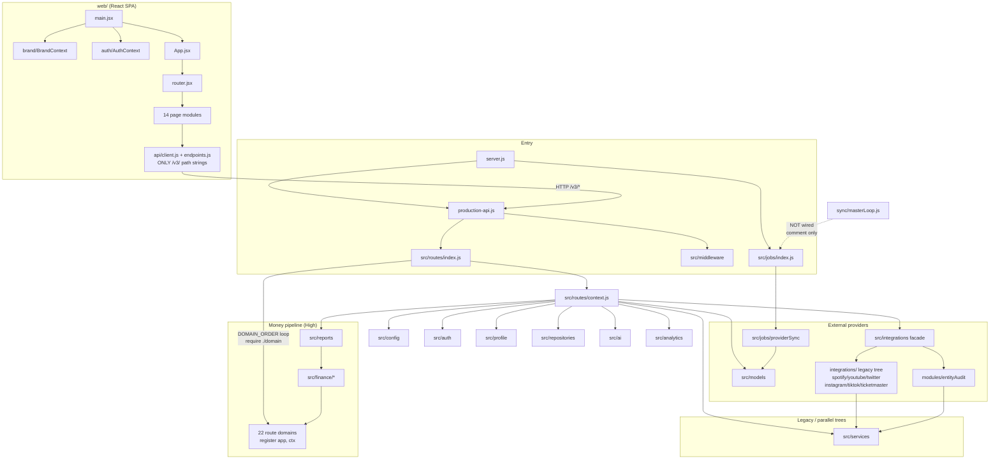

# MAP — as-is codebase map
Owner: Cartographer (MAP) · Last updated: 2026-09-29 (Phase 1)
Scope: 431 tracked files on branch `devteam/review-2026-09-29` (boot recon counted 418 on `master`;
the review branch adds `devteam/` itself plus a few review-branch additions — all 431 are in COVERAGE.md).
Every entry point below was verified by reading it. No code was changed; nothing was judged.

## 1. Summary

**The Music Scene** ("electronic-label-os" v5.0.0) is a Node/Express + React/Vite label-intelligence
platform for a single music label: royalty-statement ingestion and reconciliation, catalog
(recordings/releases/works with ISRC/UPC), A&R submission + voting rooms, marketing campaigns,
direct/merch sales, monthly close (cash, adjustments, commissions, expected reports), scheduled PDF
reporting, RBAC authentication with per-artist data isolation, provider sync (Spotify/Stripe) with
idempotency, and opt-in Groq AI insights. It is a **dedicated instance per label, NOT multi-tenant**.
"Pulsegrid" is the fictional demo label (demo ISRCs use unassigned `ZZ` country code). The backend
was refactored 2026-09-28 from a ~3.2k-line monolith into `server.js` + `production-api.js` +
`src/`; the frontend is a React 18 + Vite SPA. Money is stored as integer cents / decimal strings,
never float (per model headers; `SalesEntry.revenue` is FLOAT — DAT/BUG lane to verify).

## 2. Stack & versions

- **Runtime:** Node >= 18 (`engines` in package.json); `main: server.js`; scripts: `start: node server.js`,
  `test: node --test --test-force-exit tests/regression/*.test.js` (361 tests / 60 suites green at boot).
- **Backend deps (root package.json, 29):** express ^4.22.1, sequelize ^6.37.7 (sqlite3 ^6.0.1 / pg ^8.16.3),
  jsonwebtoken ^9.0.3, bcrypt ^6.0.0, helmet ^8.1.0, express-rate-limit ^7.5.1, cors ^2.8.5,
  compression ^1.8.1, node-cron ^4.2.1, node-cache ^5.1.2, nodemailer ^10.0.12, pdfkit ^0.17.2 +
  pdfkit-table ^0.1.99, chartjs-node-canvas ^5.0.0 (+ canvas ^3.2.0, chart.js ^4.5.1), mathjs ^15.1.0,
  zod ^4.2.1, axios ^1.13.2, multer ^2.4.0 (uploads), csv-writer ^1.6.0, dotenv ^16.6.1,
  winston ^3.19.0, groq-sdk ^0.37.0, googleapis ^168.0.0, spotify-web-api-node ^5.0.2, stripe 22.6.2
  (pinned, not caret).
- **Frontend (web/package.json):** react ^18.3.1, react-dom ^18.3.1, react-router-dom ^6.30.1,
  chart.js ^4.5.1 + react-chartjs-2 ^5.3.1, leaflet ^1.9.4 (maps), remixicon ^4.6.0; dev via Vite
  (web/vite.config.js). Scripts: `dev`, `build`, `preview`, `gate` (node validation/gate.mjs).
- **No lockfile drift check done by MAP** — BLD's lane. Lockfiles: package-lock.json, web/package-lock.json.
- **No lint/typecheck configured** (per B3, unverified by MAP).

## 3. Directory tree (annotated)

```
.                                    repo root
├── server.js                        CANONICAL ENTRYPOINT (verified §4)
├── production-api.js                Express app assembler; exports app (verified §4)
├── ecosystem.config.js              PM2 config (name pulsegrid-api, fork, 1 instance) — currency unverified
├── package.json / package-lock.json root manifest (electronic-label-os 5.0.0)
├── .env.example / .env.prod.template env templates (no .env committed)
├── src/                             backend (72 files)
│   ├── config/          config/index.js (env→config, assertSecrets) + logger.js (winston)
│   ├── middleware/      request pipeline: helmet→compression→cors→json→req-id→rate-limit; error/404
│   ├── auth/            JWT verify + hasArtistAccess/normalizeArtistAccess (index.js)
│   ├── oauth/           OAuth providers + tokenCrypto (artist OAuth tokens encrypted at rest)
│   ├── models/          Sequelize: index.js (30 models) + migrations.js (explicit repair migrations)
│   ├── repositories/    artistRepository, inMemoryStores (process-memory stores), operationsRepository
│   ├── services/        cacheService, emailService, entityAuditService, provenance,
│   │                    salesService, catalogIntegrityService, auditService, usageService
│   ├── finance/         decimal (exact math), reconciliation, commission, income, kpi, reviewState
│   ├── routes/          22 route domains + context.js (shared dep bundle) + index.js (DOMAIN_ORDER loop)
│   ├── integrations/    facade: index.js, rateLimiter, scoutService, wikipedia.fixtures
│   ├── ai/              groqClient, prompts, responseParser, disclaimer, aiService
│   ├── analytics/       regression.js (pure maths)
│   ├── reports/         monthlyReport.js (PDF builder via pdfkit)
│   ├── jobs/            index.js (registry), monthlyReportJob, providerSync
│   ├── validation/      zod request-validation layer (index.js)
│   ├── billing/         stripeClient.js
│   ├── payments/        provider interface + Stripe Connect implementation
│   ├── profile/         Label Intelligence Profile: index.js + labels/pulsegrid.js (white-label seam)
│   └── utils/           safeFilename, charts, dataShape (+ more — see COVERAGE)
├── integrations/        LEGACY provider tree (spotify, youtube, twitter, instagram, tiktok,
│                        ticketmaster, index aggregator) — still live, required via src/integrations facade
├── modules/             SafeStatsSchema (zod), entityAudit (SEO/entity health, 939 lines)
├── sync/                masterLoop.js — the intended live-data sync loop; NOT wired anywhere (MAP-002)
├── mock/                artistData.js — fictional Pulsegrid roster (required by profile labels/pulsegrid.js)
├── scripts/             run-demo.sh / stop-demo.sh (demo boot), deploy-client.sh (per-client deploy),
│                        serve-static.js (used by deploy-client), repair-sales-schema.js (DB repair),
│                        run-visual-gate.js, run-browser-workflows.js, run-verify-hermetic.js, generate_roster.js
├── demo/dataset-v1/     deterministic fixture dataset: load.js, expected.json, statements/*.csv, evidence/
├── web/                 React/Vite frontend (149 files)
│   ├── src/main.jsx → App.jsx → router.jsx (routes, ProtectedRoute/PermissionRoute)
│   ├── src/auth/        AuthContext, ProtectedRoute, PermissionRoute, permissions, useAuth
│   ├── src/api/         client.js (apiFetch), download.js, endpoints.js (ONLY file with /v3/ paths)
│   ├── src/pages/       Login, ResetPassword, Dashboard, Artists(+Detail), Anr(2 views),
│   │                    Intelligence, Marketing, Fans, Operations, Finance(5 views), Settings(3), Admin, NotFound
│   ├── src/components/  primitives (25), ai (3), reports (2), maps (2)
│   ├── src/brand/       BrandContext, themes, profiles/{pulsegrid,example-records} (static content)
│   ├── src/charts/      chart wrappers; src/hooks/ (3); src/ai/ (aiClient, useAiProviders)
│   ├── src/layout/      AppShell + nav (7); src/styles/ (2); src/utils/ (2)
│   └── validation/      gate.mjs (acceptance gate), lib.mjs, smoke.mjs, shots4c.mjs,
│                        static-checks.mjs + ~17 PNG evidence screenshots
├── tests/               regression/ (20 node:test suites), snapshots/ (3 JSON baselines),
│                        support/ (probe.js, cases.js, verify_phase2.js, sort_side_effect_check.js, *.sh)
├── docs/                65 files: audits, handoffs (PHASE_3/4A/4B/4C/4CF), openapi.json (4574 lines),
│                        whitepaper.md, PDFs (ai_insights_report, career_sustainability, final_report_v2, …)
├── execution-validation/ evidence artifacts of a 2026-09-18 validation run (JSON + PNG screenshots) — Low
├── devteam/             this review workspace (out of review scope, listed in COVERAGE)
└── logs/ .demo-data/    runtime-created, gitignored (demo sqlite + pid files)
```

## 4. Entry points & processes (all verified by reading)

| Entry point | What it does | Port / schedule |
|---|---|---|
| `server.js` | Canonical entrypoint. (1) `config.assertSecrets()` — JWT_SECRET required, ≥16 chars, else `process.exit(1)`; (2) requires `production-api`, calls `api.initializeDatabase()` and refuses to listen on failure; (3) `registerJobs()` unless `SCHEDULE_JOBS=false`; (4) `app.listen(PORT)` with graceful SIGTERM/SIGINT + unhandledRejection/uncaughtException → clean shutdown. Prints seed-user banner (demo passwords — DEMO context). | `PORT` env, default **3000** |
| `production-api.js` | Pure Express assembler (exports `app`, binds no port): `applyRequestPipeline` → `registerRoutes(app)` (22 domains via `src/routes/index.js` DOMAIN_ORDER loop, `require(\`./${domain}\`)`) → `applyErrorHandlers`. `initializeDatabase()` exposed for server.js; DEMO_MODE seeds fictional Pulsegrid data on boot, customer boots get an empty DB. | — (no listener) |
| `src/jobs/index.js` | Job registry, explicit (no schedule-on-require). `registerJobs({enabled})` registers: `monthlyReportJob` always (when enabled); `providerSync` only when `PROVIDER_SYNC_ENABLED=true`. `sync/masterLoop.js` is deliberately NOT registered (audit R5 — would change analytics from synthetic to real). | monthlyReportJob `0 3 1 * *` (03:00 1st of month); providerSync `0 4 * * *` (daily 04:00, opt-in only) |
| `scripts/run-demo.sh` | Demo boot: generates random demo-only JWT_SECRET into `.demo-data/.env` (gitignored, mode 600) on first launch; starts API (`PORT` default 4000, `DEMO_MODE=true`, `DB_STORAGE=.demo-data/demo.sqlite`, `SCHEDULE_JOBS=false`) and Vite (`--host 0.0.0.0`, default 5173, `VITE_API_BASE_URL=http://<host-ip>:4000`); PID files in `logs/*.pid`; curl health-checks `/health` + `/` before returning. | API :4000, UI :5173 |
| `scripts/stop-demo.sh` | Stops only PIDs recorded in `logs/api.pid` / `logs/web.pid` (graceful → SIGKILL fallback). No broad pkill. | — |
| `ecosystem.config.js` | PM2 app `pulsegrid-api`, `script: ./server.js`, `instances: 1`, `exec_mode: fork`, logs to `./logs/pm2-*.log`. Currency of this config vs current code **unverified** (BLD lane). | — |

Boot order: `server.js` → secret guard → `production-api` (middleware → 22 route domains → error handlers) → `initializeDatabase()` (explicit migrations in `src/models/migrations.js`, then `sync()` creates missing tables; DEMO_MODE seeds fixtures) → `registerJobs()` → `listen(PORT)`.

## 5. Module map (Mermaid)

Derived from `require()` grep across `src/`, `server.js`, `production-api.js` and `import` in `web/src`.
Route modules get their dependencies via the `ctx` bundle built in `src/routes/context.js`
(transitional seam — ~20 modules injected), not via individual imports.



**God modules / fan-out outliers** (ARC lane to assess): `src/routes/context.js` (injects ~20 deps into
every route module — deliberate transitional seam), `src/models/index.js` (31 Sequelize models, 761 lines),
`src/routes/royalties.js` (1076 lines), `src/routes/directsales.js` (712 lines),
`src/routes/monthlyclose.js` (564 lines), `modules/entityAudit.js` (939 lines), `docs/openapi.json`
(4574 lines — spec artifact).

**Cycles:** none found. `require()` graph is a DAG: routes → context → services/models; `src/routes/anr.js:252`
calls `require('./anrRoom').register(app, ctx)` but `anrRoom` is NOT in DOMAIN_ORDER (single registration,
not a double-bind). No file requires `src/routes/*` from outside the routes tree.

## 6. Data stores & models

- **Primary store:** Sequelize. SQLite file by default (`DB_STORAGE`, default from profile `sqliteFile`
  = `pulsegrid_v5.sqlite`); Postgres via `DATABASE_URL` + `DB_DIALECT=postgres`.
- **Migrations:** `src/models/migrations.js` — explicit, idempotent repair migrations run at startup
  (`repairSalesSchema` w/ `VACUUM INTO` backup, `addUserSecurityColumns`, `addRoyaltyDedupColumns`,
  `addMonthlyCloseColumns`); `sync()` creates absent tables. `scripts/repair-sales-schema.js` is the
  standalone CLI for the same repair.
- **30 models** (`src/models/index.js` exports — DAT verified 30 define calls; cartographer miscounted 31): User, Artist, Stats, ProviderSyncExecution, AuditEvent,
  AnrSubmission, SalesEntry, RoomDemo, RoomVote, RoomSetting, Campaign, Subscription, ArtistOAuth,
  Recording, Release, Work, WorkRecording, **RoyaltyLine**, RoyaltyStatement, MerchSettlement,
  PaymentConnection, DirectSale, ArtistPaymentMapping, ManualAdjustment, Payout, BankDeposit,
  CashGapAnnotation, CommissionContract, ExpectedReport, SourceMapping.
  - Money discipline: `MerchSettlement` uses integer cents + ISO currency w/ review state machine;
    `RoyaltyLine` has statement-identity columns + full row-content-hash dedup (unique indexes dropped
    by migration); `SalesEntry.revenue` is FLOAT (noted for DAT/BUG).
- **In-memory stores:** `src/repositories/inMemoryStores.js` — "single owner of every process-memory
  store the monolith kept at module scope" (PRF/ARC: fork-mode PM2 + multi-instance implications).
- **Cache:** `node-cache` via `src/services/cacheService.js` (single owner).
- **Demo fixtures:** `demo/dataset-v1/` — deterministic, idempotent: `load.js` seeds statements
  (3 CSVs), `expected.json` (71 lines) is the assertion target; `demoMode.test.js` + `demoDataset.test.js`
  cover it. `.demo-data/` (gitignored) holds the throwaway demo sqlite + demo-only JWT.
- **Files written at runtime:** `reports/<YYYY-MM>/` (monthly PDFs), `logs/*.log`, `logs/*.pid`,
  `backups/before-sales-repair-*.sqlite` (migration backup, mode 0600, dir 0700), `web/dist/` (build).
- **No dedicated session store** — JWT (24h expiry) + per-request DB revalidation (`sessionVersion`).

## 7. External services and where called

| Service | Where | Notes |
|---|---|---|
| Spotify (spotify-web-api-node) | `integrations/spotify.js`, `src/jobs/providerSync.js` (sales-pull/artist-stats), `src/routes/oauth.js`, `src/routes/anr.js`, `src/routes/marketing.js` | Artist OAuth tokens encrypted at rest (`src/oauth/tokenCrypto.js`) |
| Stripe (stripe 22.6.2) | `src/billing/stripeClient.js`, `src/payments/providers/stripe.js` (Stripe Connect), `src/routes/billing.js`, `src/routes/directsales.js`, `src/routes/royalties.js`, `src/jobs/providerSync.js` (sales-pull); webhook secret env | `STRIPE_STUB` / `PAYMENTS_STUB*` fixture modes exist |
| Groq (groq-sdk, opt-in) | `src/ai/groqClient.js`, `src/ai/aiService.js`, `src/ai/prompts.js`, `src/ai/responseParser.js`, `src/routes/ai.js`, `src/services/entityAuditService.js` | Opt-in; keys server-side |
| Google APIs (googleapis) | `integrations/youtube.js` (YouTube Analytics), `modules/entityAudit.js`, `src/oauth/providers.js` | |
| YouTube / Twitter / Instagram / TikTok / Ticketmaster | `integrations/{youtube,twitter,instagram,tiktok,ticketmaster}.js` via axios; aggregated by `integrations/index.js`, facaded by `src/integrations/index.js` | Attribution model: fail-closed handle matching (per file headers) |
| Wikipedia | **Fixtures only** — `src/integrations/wikipedia.fixtures.js`, gated by `FIXTURE_WIKIPEDIA=1`; `src/routes/artists.js` requires `wikiAudit.musicRelated` else `wikipedia: null` (fixed 2026-09-28, commit 4a4686c) | No live Wikipedia calls in production paths |
| Email (nodemailer / SMTP / SendGrid) | `src/services/emailService.js` (`SMTP_HOST/PORT/USER/PASS`, `SENDGRID_API_KEY`, `EMAIL_FROM`); password-reset links via `RESET_LINK_BASE` | |
| Printer (lp/lpr) | `src/jobs/monthlyReportJob.js` `autoPrintReport()` — `execFile` w/ arg array, `AUTO_PRINT` gate (command-injection fix 2026-09-28) | Shell-out, fail-closed path checks |

## 8. Inputs (sources) & outputs (sinks) — trust boundaries

**Sources (untrusted → in):** HTTP bodies/query/params on 22 route domains (`express.json`, multer uploads);
CSV statement files (royalty + atVenu merch imports); `DATABASE_URL`/env; provider API responses
(Spotify/Stripe/YouTube/socials — validated via zod `SafeStatsSchema` + provenance wrapper);
Groq LLM output (`src/ai/responseParser.js` — schema-validated); OAuth callbacks; demo fixture CSVs.
**Sinks (out):** Sequelize → SQLite/Postgres; filesystem (`reports/*.pdf`, logs, pid files, backups,
`.demo-data/`); shell (`lp/lpr` via execFile); email (nodemailer); HTTP responses (JSON); PDF/CSV
exports (`pdfkit`, `csv-writer`, `ExportControls.jsx` downloads); browser DOM (React renders provider
+ LLM data — UIX/SEC); logs (winston — PII/token hygiene per SEC checklist); `ProviderSyncExecution`
rows (sanitized error summaries).

**Trust boundaries:** internet → Express (helmet/cors/rate-limit) → `authenticateToken` composite
(JWT verify in `src/auth` + per-request DB revalidation in `src/routes/context.js`: user row, `active`,
`sessionVersion`) → role/artistAccess/pageAccess checks per route → services → DB/providers.
Demo/customer separation: `DEMO_MODE` gate on fictional seeding; demo JWT lives only in
`.demo-data/.env`.

## 9. Config & env

Summary — full inventory is BLD's `notes/env-inventory.md`. Backend reads 50 env vars (verified by grep):
`JWT_SECRET` (required, ≥16 chars, fail-closed in `assertSecrets()`), `ADMIN_EMAIL`/`ADMIN_PASS`
(env-level admin override; both-or-neither), `DEMO_MODE`, `DATABASE_URL`, `DB_DIALECT`, `DB_STORAGE`,
`PORT` (default 3000), `NODE_ENV`, `ALLOWED_ORIGINS` (CORS; dev allows localhost/file://),
`PROVIDER_SYNC_ENABLED`, `SCHEDULE_JOBS`, `USE_REAL_DATA`, `AUTO_PRINT`, `RESET_LINK_BASE`,
`EMAIL_FROM`, `SMTP_*`/`SENDGRID_API_KEY`, `GROQ_API_KEY`/`GROQ_MODEL`, `SPOTIFY_CLIENT_ID/SECRET`,
`STRIPE_*` (secret, webhook, prices, cancel/success URLs, `STRIPE_STUB`), `LABEL_STRIPE_*` (Connect),
`PAYMENTS_STUB*`, `OAUTH_*` (`OAUTH_TOKEN_KEY`, `OAUTH_STUB`, `OAUTH_REDIRECT_BASE`),
`ACTIVE_LABEL`/`LABEL_SLUG`/`LABEL_PROFILE` (white-label seam), `FIXTURE_WIKIPEDIA`.
Frontend (`import.meta.env`): `VITE_API_BASE_URL`, `VITE_BRAND_PROFILE`, `VITE_MAP_TILE_URL`,
`VITE_MAP_TILE_ATTRIBUTION`, `DEV`. Templates: `.env.example`, `.env.prod.template`, `web/.env.example`.
PM2 env blocks in `ecosystem.config.js` (currency unverified).

## 10. Critical flows (proposed — BUG/SEC trace these in Phase 2)

1. **Login → token → RBAC enforcement** — `POST /v3/auth/login` → JWT (24h) → composite
   `authenticateToken` (per-request DB revalidation: row exists, `active`, `sessionVersion`) →
   role/artistAccess/pageAccess per route. Files: `src/routes/auth.js`, `src/auth/index.js`,
   `src/routes/context.js`.
2. **Royalty CSV import → matching → reconciliation → monthly close → payout** —
   `src/routes/royalties.js` (1076 lines), `src/finance/reconciliation.js`, `src/routes/monthlyclose.js`
   (564), models RoyaltyLine/RoyaltyStatement/ManualAdjustment/Payout/BankDeposit/CashGapAnnotation.
3. **Provider sync run → executions** — `POST /v3/sync/run` or cron `0 4 * * *` (opt-in) →
   `src/jobs/providerSync.js` → `ProviderSyncExecution` rows (idempotency key, bounded retries,
   fixture mode when credential-less).
4. **Demo-mode boot vs customer boot** — `server.js` → `initDB({demoMode})`: DEMO_MODE=true seeds
   `demo/dataset-v1` into throwaway sqlite; customer boot = empty DB.
5. **Password reset** — request → `User.resetToken`/`resetTokenExpiry` → email link
   (`RESET_LINK_BASE`) → `ResetPasswordPage` → reset; `sessionVersion` bump revokes sessions.
6. **GDPR export / user delete** — `DELETE /v3/users/:id` (+ `/v3/auth/me`), `src/routes/users.js`,
   `src/routes/auth.js` (completeness across DB/files/reports/logs TBD by SEC/DAT).
7. **PDF/CSV export** — `src/reports/monthlyReport.js`, `src/routes/reports.js`,
   `web/src/components/reports/ExportControls.jsx` (formula-injection surface — SEC).
8. **A&R submission → voting** — `src/routes/anr.js` + `anrRoom.js` (registered once, from anr.js:252),
   models AnrSubmission/RoomDemo/RoomVote/RoomSetting.
9. **Stripe billing & artist OAuth connect** — `src/routes/billing.js`, `src/routes/oauth.js`,
   `src/billing/stripeClient.js`, `src/payments/providers/stripe.js`, `src/oauth/tokenCrypto.js`.

## 11. Oddities

- **Duplicate registration (dead code, self-documented):** `src/routes/users.js` registers
  `app.delete('/v3/users/:id')` twice (~L207 guarded handler wins; ~L288 shadowed duplicate never
  binds). The in-code comment acknowledges this. → MAP-001.
- **Orphan live-data path:** `sync/masterLoop.js` (`masterSyncLoop()`) is required by nothing;
  `src/jobs/index.js` header says it is deliberately unregistered (audit R5). → MAP-002.
- **Parallel integration trees:** `integrations/` (legacy, 7 files) still live, required through the
  `src/integrations/` facade (`src/integrations/index.js:19` → `../../integrations`). → MAP-003.
- **asymmetric route registration:** `src/routes/anrRoom.js` is not in DOMAIN_ORDER; it registers only
  via `require('./anrRoom').register(app, ctx)` inside `src/routes/anr.js:252`. Single binding,
  verified — but fragile. → MAP-004.
- **Unreferenced tooling:** `scripts/generate_roster.js` (no npm script, no requires);
  `scripts/run-visual-gate.js` referenced only from `web/validation/gate.mjs`'s header comment
  (not in `package.json` scripts). → MAP-005.
- **Legacy-name references in docs:** `docs/audit/01-two-repo-audit.md` names
  `mau5trap-production-api.js`; 9 docs name `Server v5.js`; 4 handoff docs name `src/api.js`
  (the last is `web/src/api/` — different thing). All are **historical audit context** about the
  pre-refactor code, not claims about current code; nothing in `src/`, `scripts/` or `web/src`
  references the old servers. No live dangling references found.
- **Snapshot baselines:** `tests/snapshots/` holds `baseline.json`, `phase2_baseline.json`,
  `repaired_contracts.json` — three generations; only `phase2_baseline.json` is written by
  `npm run snapshot:baseline` (probe.js). Which baseline is authoritative is a TST question.
- **Evidence dirs are committed:** `execution-validation/` (67 files: JSON evidence + PNG screenshots)
  and `web/validation/*.png` (~17 files) are tracked binary/evidence artifacts — belong-or-not
  decision for BLD/DOC (repo hygiene).
- **`docs/openapi.json` (4574 lines):** generated-or-handwritten API spec; sync with the 22 route
  domains unverified (DOC claims audit).
- **`.env.example` history note:** header references "(CRITICAL-2 fixed in Phase 3)" — the demo
  script generates a real random JWT into gitignored `.demo-data/.env`; no secret values are
  committed (MAP verified no `.env` tracked).
