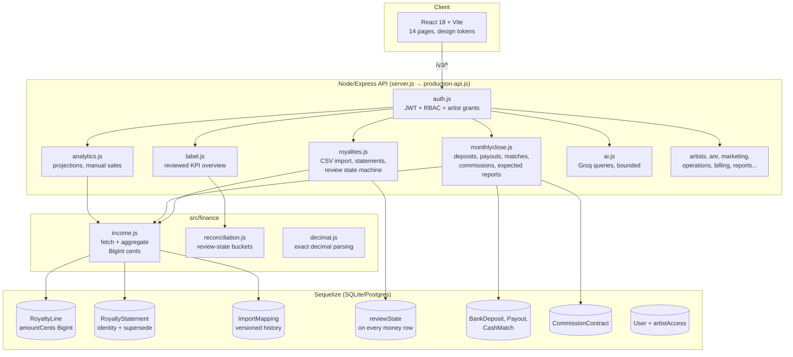

# Step 1 — Two-Repo Audit: The Music Scene (Pulsegrid)

**Date:** 2026-09-28
**Working repo:** `/home/dino/mau5trap-repo` → `dynoshippedit/musicsceneapi-demo` (main @ 37035f3)
**Reference repo:** `bufirstrepo/mau5trap-repo` (read-only, 2 commits, 66 files) — NEVER modified, NEVER pushed to.

---

## 1. File Inventory

### Reference repo (bufirstrepo/mau5trap-repo) — 66 files
The original: a static HTML fan-site demo + monolithic API prototype.

| Area | Files |
|---|---|
| Static HTML frontends | `mau5trap-frontend-connected.html`, `mau5trap-terminal-dashboard.html`, `artist-analytics-api-docs.html`, `deadmau5-api-docs.html` |
| Monolithic API | `mau5trap-production-api.js` (3,207 lines), `Server v5.js` (99 lines) |
| Integrations (stubs) | `integrations/{index,instagram,spotify,ticketmaster,tiktok,twitter,youtube}.js` |
| Sync | `sync/masterLoop.js` |
| Mock data | `mock/artistData.js` |
| Modules | `modules/entityAudit.js`, `modules/SafeStatsSchema.js` |
| Docs | `MASTER_GUIDE.md`, `PRODUCTION_DEPLOYMENT.md`, `PRODUCTION_FEATURES.md`, `QUICKSTART.md`, `START_HERE.md`, `SYSTEM_OVERVIEW.md`, `README.md` |
| Reports (PDF) | `ai_insights_report.pdf`, `career_sustainability_report.pdf`, etc. |
| Test scripts | `test-*.js`, `verify_*.js` (ad-hoc, not a suite) |
| Misc | `package*.json`, `ecosystem.config.js`, `.env.example`, images, CSV/PDF fixtures |

### Working repo (dynoshippedit/musicsceneapi-demo) — 451 files
A full rewrite/expansion. Key areas:

| Area | Files | Notes |
|---|---|---|
| `src/routes/` | 22 | 95 unique `/v3/*` routes (126 with method variants) |
| `src/finance/` | 6 | `income.js`, `reconciliation.js`, `decimal.js`, commissions, cash matching |
| `src/models/` | 2 | Sequelize models + migrations |
| `src/services/` | 8 | sales, cache, email, entity-audit |
| `src/ai/` | 5 | Groq client, prompts, parsing |
| `src/integrations/`, `src/oauth/`, `src/payments/` | 8 | provider facade, Stripe Connect |
| `src/jobs/`, `src/repositories/`, `src/utils/`, `src/config/` | 9 | |
| `src/profile/` | 2 | Label Intelligence Profile (white-label) |
| `web/src/` | 116 | React + Vite frontend, 14 pages |
| `web/validation/` | 23 | static gate (9 checks), smoke, screenshots |
| `tests/regression/` | 17 | 333 backend tests, 56 suites |
| `tests/snapshots/` | 4 | API snapshot contracts |
| `execution-validation/` | 70+ | browser workflows, forensic docs |
| `scripts/` | — | `run-demo.sh`, `stop-demo.sh` (one-command launch) |
| Root | — | `server.js` (canonical entry), `production-api.js` (assembler), `ecosystem.config.js` |

---

## 2. Comparison: Reference → Working

| Dimension | Reference (bufirstrepo) | Working (musicsceneapi-demo) |
|---|---|---|
| Architecture | 2 monoliths (3,207-line API + 99-line server) | Modular: 22 route files, services, finance lib, models |
| Frontend | Static HTML files | React 18 + Vite, 14 pages, design-token system |
| Database | JSON file (`mau5_db.json`) | Sequelize (SQLite/Postgres), migrations |
| Financial ingestion | None | CSV import, statement identity, mapping history, review states |
| Money arithmetic | N/A (floats in mocks) | BigInt cents + exact decimals, never float |
| Auth | Hardcoded users, `JWT_SECRET` fallback | Required JWT secret, RBAC (admin/artist), per-artist grants |
| Tests | Ad-hoc `test-*.js` scripts | 333 tests / 56 suites + snapshot contracts + browser workflows |
| Branding | Hardcoded mau5trap | White-label "Label Intelligence Profile" (Pulsegrid) |
| API surface | Undocumented handful | 95 unique `/v3/*` routes |

**Lineage verdict:** The working repo is a ground-up rewrite, not a fork. Only `Server v5.js` is a direct rebrand (byte-identical except mau5trap→pulsegrid strings). No business logic was carried over verbatim; the domain was re-implemented with proper persistence, auth, and financial controls.

---

## 3. Connection Matrix (Working Repo)

```
                    ┌──────────────┐
                    │   server.js  │  canonical entry: secrets → DB → jobs → listen
                    └──────┬───────┘
                           │ requires
                    ┌──────▼───────┐
                    │production-api│  assembler: Express app from src/* modules
                    └──────┬───────┘
           ┌───────────────┼────────────────┐
           ▼               ▼                ▼
   ┌──────────────┐ ┌─────────────┐ ┌──────────────┐
   │ src/routes/* │ │ src/models/ │ │ src/profile/ │
   │ 22 route     │ │ Sequelize   │ │ Label profile│
   │ modules      │ │ models +    │ │ (white-label │
   └──┬───┬───┬───┘ │ migrations  │ │  seed data)  │
      │   │   │     └──────┬──────┘ └──────────────┘
      │   │   │            │
      ▼   ▼   ▼            ▼
 ┌────────┐ ┌──────────┐ ┌────────────┐ ┌──────────┐
 │finance/│ │services/ │ │reposito-   │ │ai/       │
 │income, │ │sales,    │ │ries/      │ │groq,     │
 │recon-  │ │cache,    │ │artist     │ │prompts   │
 │ciliation│ │email    │ │data access│ │          │
 └────────┘ └──────────┘ └────────────┘ └──────────┘
      │            │
      ▼            ▼
 ┌─────────────────────────┐
 │ web/src (React)         │  14 pages → /v3/* API
 │ FinancePage = monthly   │
 │ close workspace         │
 └─────────────────────────┘
```

**Route → module ownership:**

| Route prefix | Owner file | Domain |
|---|---|---|
| `/v3/royalties/*` | `src/routes/royalties.js` | Royalty CSV import, statements, review |
| `/v3/financials/*` | `src/routes/monthlyclose.js` | Deposits, payouts, matches, commissions, expected reports, mappings |
| `/v3/analytics/*` | `src/routes/analytics.js` | Projections, manual sales, geography |
| `/v3/label/*` | `src/routes/label.js` | Label overview (reviewed KPIs) |
| `/v3/direct-sales/*` | `src/routes/directsales.js` | Stripe direct sales |
| `/v3/ai/*` | `src/routes/ai.js` | AI queries (Groq, bounded) |
| `/v3/anr/*` | `src/routes/anr.js`, `anrRoom.js` | A&R scouting, demos, voting |
| `/v3/auth/*`, `/v3/users*` | `src/routes/auth.js`, `users.js` | Auth, RBAC |
| `/v3/artists*`, `/v3/tours` | `src/routes/artists.js` | Artist roster |
| `/v3/integrations/*`, `/v3/oauth/*` | `src/routes/integrations.js`, `oauth.js` | Provider connections |
| `/v3/billing/*` | `src/routes/billing.js` | Stripe billing |
| `/v3/marketing/*`, `/v3/campaigns/*` | `src/routes/marketing.js` | Campaigns |
| `/v3/operations/*`, `/v3/catalog/*` | `src/routes/operations.js`, `catalog.js` | Ops, catalog integrity |
| `/v3/reports/*`, `/v3/exports` | `src/routes/reports.js`, `finance.js` | PDF reports, exports |
| `/v3/fans/*` | (fans routes) | Fan demographics |

---

## 4. Ownership Map

| Area | Owner (code) | Data owned |
|---|---|---|
| Royalty ingestion | `royalties.js` + `finance/income.js` | RoyaltyLine, RoyaltyStatement, ImportMapping |
| Review workflow | `royalties.js` reviewTransition | reviewState machine (reported→reconciled→approved) |
| Cash evidence | `monthlyclose.js` | BankDeposit, Payout, CashMatch (never income) |
| Commissions | `monthlyclose.js` + finance | CommissionContract, worksheet (deterministic) |
| Expected reports | `monthlyclose.js` | ExpectedReport, gaps/annotations |
| KPI aggregation | `finance/income.js` + `finance/reconciliation.js` | counted/approved/disputed/estimated buckets |
| Projections | `analytics.js` + `services/salesService.js` | linear regression on counted income |
| Auth/RBAC | `src/auth/`, `auth.js` | User, JWT, artistAccess grants |
| Label profile | `src/profile/labels/pulsegrid.js` | seed users, seed artists, brand |
| Frontend finance | `web/src/pages/FinancePage/` | monthly-close workspace UI |

---

## 5. Architecture Diagram (Mermaid)



---

## 6. Defect Register (from independent review)

| ID | Severity | Finding | Status |
|---|---|---|---|
| D1 | **Critical** | Import superseded ALL active statements on same (source, period), destroying unrelated lines | **FIXED** — overlap-triggered unit supersede (ca71369) |
| D2 | High | `/v3/analytics/sales` created duplicate ManualAdjustments on repost (old SalesEntry upserted) | **FIXED** — upsert on (artistId, month, manual_entry_api) (ca71369) |
| D3 | High | Label overview/projections read float SalesEntry, ignoring royalty income | **FIXED** — full counted-income pipeline (b3802d2, verified) |
| D4 | Medium | `currencies[]` review-state shape dropped per-category breakdown | **FIXED** — restored with royalties/merch/sales/adjustments (ca71369) |
| D5 | Medium | FinancePage/DashboardPage CSS referenced nonexistent tokens (`--text-muted` etc.) with hex fallbacks — wrong colors rendered + S05 gate fail | **FIXED** — real tokens `--color-*` (ca71369) |
| D6 | Medium | Browser workflow fixtures predated rebrand (stale logins, artist IDs) | **FIXED** — updated to pulsegrid seeds (ca71369) |
| D7 | Low | `Server v5.js` legacy monolith still in repo root (dead code, not served) | OPEN — candidate for removal/archival |
| D8 | Low | `production-api.js` header still references old phase docs | OPEN — cosmetic |
| D9 | Info | `origin` remote points to bufirstrepo (push blocked by design) | BY DESIGN — never push there |

---

## 7. Baseline (2026-09-28, verified HEAD 37035f3)

| Suite | Result |
|---|---|
| Backend (`npm test`) | **333/333 pass**, 56 suites, 0 skipped |
| Web static gate | **9/9 pass** |
| Web build (`vite build`) | Clean |
| Browser workflows | **8/8 pass** |
| Live monthly-close journey (API) | Import → reconcile → approve → deposit → KPIs verified |
| Demo services | API :4000 (401 on unauth = healthy), UI :5173 (200) |
| Remote | `dynoshippedit/musicsceneapi-demo` main @ 37035f3 |

**Divergence note:** The reference repo is not an ancestor — `git log` shows no shared history. Treat it as a domain reference only, never a merge source.
